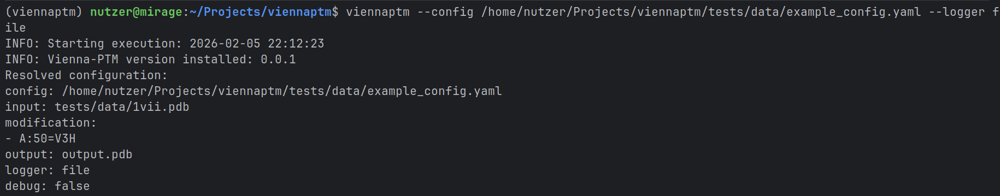

Tutorial
============

.. rubric:: HOW TO USE VIENNA PTM

When the :doc:`installation` of ViennaPTM and its dependencies is finished you have multiple ways of using it.
The entrypoint allows a usage via command line or a config file whereas the API offers more possibilities for adapt
to specific user needs and is therefore a favoured option for proprietary data, batch processing of if user
modifications are needed.

Here we start with a user journey for a command line input.

.. rubric:: Command line

.. code-block:: python

   # 1. Activate conda environment in your console
   conda activate viennaptm

   # 2. Use entrypoint command line to run ViennaPTM
   viennaptm --input tests/data/1vii.pdb \
             --modification "A:50=V3H" \
             --output testoutput.pdb

.. image:: _static/example.png

For a more detailed explanation of the available parameters please check the :doc:`entrypoint` page.

.. rubric:: Config file

Make a config file in yaml format.

.. code-block:: python

    input: ./tests/data/1vii.pdb
    modification:
      - "A:50=V3H"
    output: output.pdb
    logger: console
    debug: false

Run the config file via the console.

.. code-block:: python

    viennaptm --config /home/nutzer/Projects/viennaptm/tests/data/example_config.yaml

.. image:: _static/config.png

You can still selectively override certain parameters. Simply add those changes to the end of
the code line:

.. code-block:: python

   viennaptm --config /home/nutzer/Projects/viennaptm/tests/data/example_config.yaml --input tests/data/1vii.pdb

