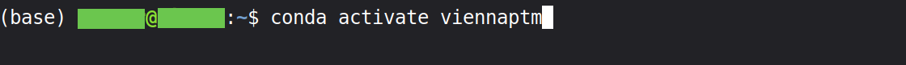
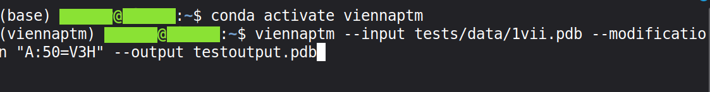
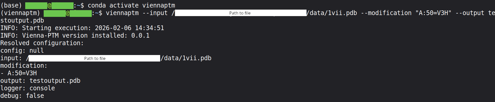
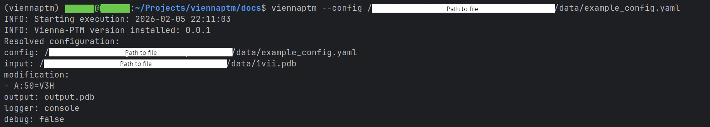
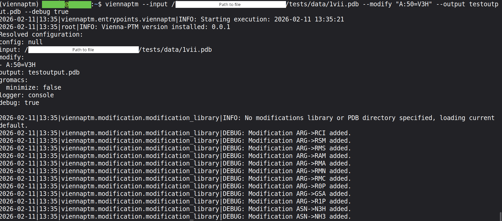

Tutorial
============

.. rubric:: HOW TO USE VIENNA-PTM

Once Vienna-PTM (and optionally GROMACS) is installed (see the :doc:`installation` page for all necessary steps), there are multiple ways to run it.

The entrypoint provides quick and easy usage via the command line (CLI) or a configuration file. The Application Programming Interface (API) offers more flexibility and is recommended for batch processing or advanced user modifications.

This tutorial starts with an example of CLI usage.

.. rubric:: COMMAND LINE

**1. Environment**

To run Vienna-PTM, first activate the conda environment in your terminal:

.. code-block:: bash

   conda activate viennaptm

**2. Run**

Next, use the entrypoint command to generate the desired post-translational modifications. For detailed explanations of available parameters, see the :doc:`entrypoint` page.

.. code-block:: bash

   viennaptm --input tests/data/1vii.pdb \
             --modify "A:50=V3H" \
             --output testoutput.pdb

**3. Finish**

Congratulations! You have generated your first Vienna-PTM run. The modified structure is now saved in the output file (here: "testoutput.pdb").

.. rubric:: CONFIG FILE

For repetitive runs, a configuration file can be useful as it reduces the risk of typos or mistakes.

**1. Generate file**

Start by creating a `YAML <https://yaml.org/spec/1.2.2/>`__ config file containing the desired parameters. See the :doc:`entrypoint` page for a full list of options.

Example config file:

.. code-block:: yaml

    input: ./tests/data/1vii.pdb
    modify:
      - "A:50=V3H"
    output: output.pdb
    logger: console
    debug: false

Another example:

.. code-block:: yaml

    input: ./tests/data/1vii.cif
    modify:
      - "A:50=V3H"
      - "A:55=GSA"
      - "A:60=ASN"
    output: output.pdb
    logger: logger_test_file
    debug: true

**NOTE:** `JSON <https://www.json.org/json-en.html>`__ format can also be used, which can be convenient for REST endpoints.

**2. Run**

Run the config file via the terminal:

.. code-block:: bash

    viennaptm --config tests/data/example_config.yaml

**3. Selectively override**

You can override specific parameters on the command line. For example, to redirect logging to a file instead of the console:

.. code-block:: bash

   viennaptm --config tests/data/example_config.yaml --logger file

Multiple parameters can be changed at once. For example, to change both the logger and the input file:

.. code-block:: bash

   viennaptm --config tests/data/example_config.yaml --logger file --input tests/data/1vii.cif

**4. Logger details**

Vienna-PTM uses Python's `logging` module. Log levels indicate the severity or importance of messages:

DEBUG

| • Purpose: Detailed information useful for diagnosing problems and understanding the program’s internal state.
| • Use case: Outputs every step of a calculation, data transformation, or function call.
| • Visibility: Only shown if the logger is set to `DEBUG`.

INFO

| • Purpose: General information about the progress of the program.
| • Use case: High-level messages a user or developer might want to see during normal operation.
| • Visibility: Shown if the logger is set to `INFO` or lower (`DEBUG` also shows `INFO`).

WARNING

| • Purpose: Indicates something unexpected or potentially problematic, but not fatal.
| • Use case: Non-critical issues, such as missing optional data or minor inconsistencies.
| • Visibility: Always shown if the logger level is `WARNING` or lower.

.. code-block:: bash

   viennaptm --config tests/data/example_config.yaml --debug true

